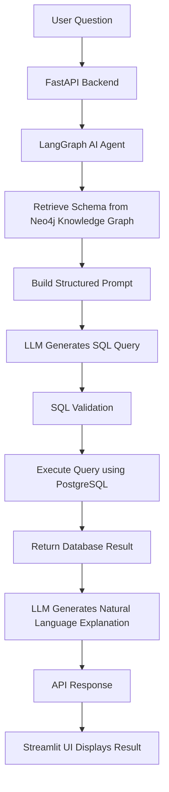

# 🤖 AI SQL Query Agent

An intelligent AI-powered system that converts natural language queries into SQL using LLMs, LangGraph, and a Neo4j knowledge graph for schema understanding.

---

## 🚀 Features

* 🧠 Natural Language → SQL conversion
* 🔗 LangGraph-based AI agent workflow
* 🗂️ Neo4j knowledge graph for schema understanding
* ⚡ FastAPI backend for API handling
* 🎨 Streamlit interactive UI
* 🛢️ PostgreSQL query execution
* 📊 LLM-based result explanation

---

## 🧠 Architecture



---

## ⚙️ How It Works

1. User submits a natural language query
2. LangGraph agent retrieves schema from Neo4j
3. Structured prompt is built for the LLM
4. LLM generates SQL query
5. Query is validated and executed
6. Result is converted into human-readable explanation
7. Response is displayed in Streamlit UI

---

## ⚙️ Setup Instructions

### 1️⃣ Clone the repository

```
git clone https://github.com/kushwanth-AI/ai-sql-query-agent.git
cd ai-sql-query-agent
```

---

### 2️⃣ Create virtual environment

```
python -m venv venv
venv\Scripts\activate
```

---

### 3️⃣ Install dependencies

```
pip install -r backend/app/requirements.txt
pip install streamlit
```

---

### 4️⃣ Run Backend (FastAPI)

```
cd backend
uvicorn app.main:app --reload
```

👉 API Docs: http://127.0.0.1:8000/docs

---

### 5️⃣ Run Frontend (Streamlit)

```
cd frontend
streamlit run streamlit_app.py
```

👉 Open: http://localhost:8501

---

## 📸 Demo


---

## 💡 Key Highlights

* Built a LangGraph-based AI agent for structured reasoning
* Improved SQL accuracy using Neo4j knowledge graph
* Modular architecture (API + Agent + LLM + DB)
* Scalable and production-ready design

---

## 🧩 Tech Stack

* **Backend:** FastAPI
* **Frontend:** Streamlit
* **Language:** Python
* **LLM Integration:** OpenAI / LangChain / LangGraph
* **Database:** PostgreSQL
* **Knowledge Graph:** Neo4j

---

## 🎯 Future Improvements

* Add authentication system
* Improve SQL validation and error handling
* Deploy on cloud (Azure / AWS / Render)
* Add caching for faster responses
* Enhance UI/UX

---

## 👨‍💻 Author

**Kushwanth**

---

## ⭐ Support

If you found this project useful, consider giving it a ⭐ on GitHub!
